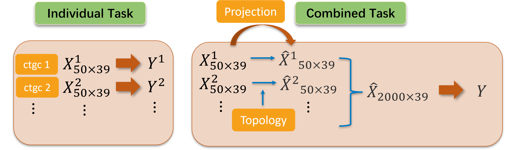
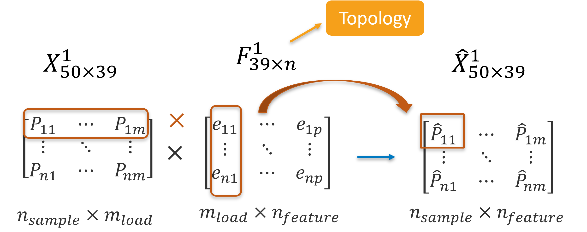
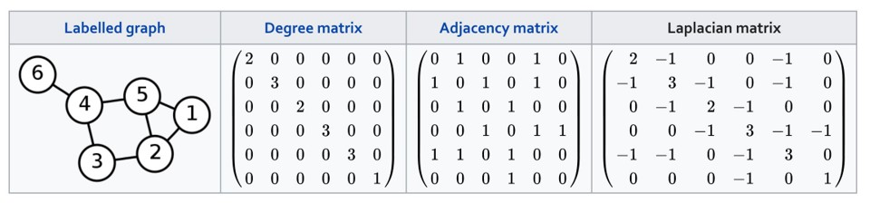
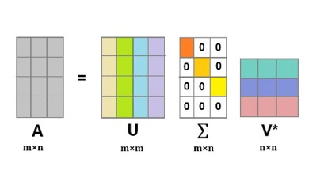

# PowerSystemTopology

**`Under Development`**

Code for the paper: Power System Overloading Risk Assessment Considering Topology and Renewable Uncertainties, IEEE PES GM 2024.

This repo is currently under development as more detailed introduction and better-quality plots will be included.

## Requriements

[Matpower](https://matpower.org/)

[UQLab](https://www.uqlab.com/)

## Introduction

The code consists of two parts:

1. Data Generation: Code comments can be found in "dataset_generation/main.m".
This part is for generating power flow simulation data.

3. Proposed PPGP method and topology embedding approach: Code comments can be found in "main_ppgp_topo.m".
This part is for constructing PPGP model and embedding topology information into input.

### Topology Embedding
- Topology embedding while preserving input structure:

<div align=center>


</div>

- Topology embedding via Laplacian matrix and SVD:
    - Laplacian matrix (degree matrix minus adjacency matrix): $` L = D - A `$
    - SVD decomposition: $` L = U \Sigma V^T `$
    - New input: $` \hat{X} = X \times V^T `$

<div align=center>


</div>


## FolderTree
```bash
.
└── PPGP-topology/
    ├── dataset_generation/        # This folder is for generating dataset
    │   └── ...
    ├── plot_topo/
    │   └── ...
    ├── ppgp_iso/                  # This folder is for PPGP with isotropical kernel
    │   └── ...
    ├── utility/                   # This folder contains utility functions
    │   └── ...
    ├── main_ppgp_topo.m           # main function
    └── ReadMe.txt
```

## References

Parallel partial Gaussian process by Mengyang Gu: [RobustGaSP-in-Matlab](https://github.com/MengyangGu/RobustGaSP-in-Matlab) or [RobustGaSP-in-R](https://cran.r-project.org/web/packages/RobustGaSP/index.html)

Note: An isotropic kernel is highly recommended for efficiency and its implementation can be found in the R package. Matlab implementation is not open source in this repository.
